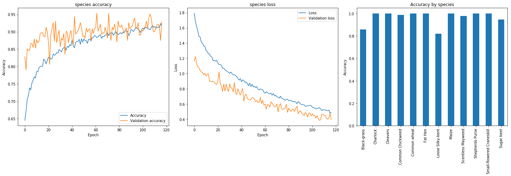
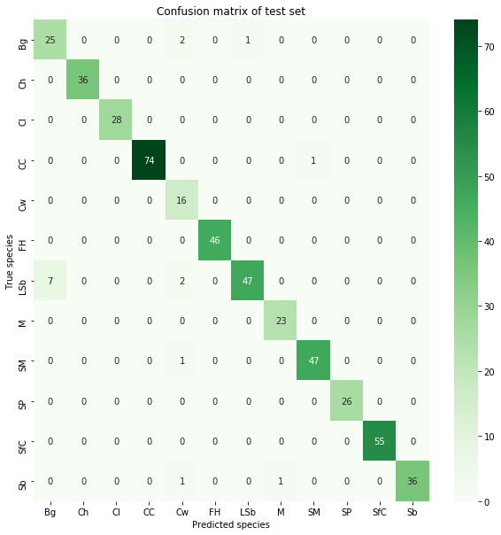

# The project
The problem to analyze is the [Kaggle plant seedlings classification](https://www.kaggle.com/c/plant-seedlings-classification).

##  Competition goal
The goal is to differentiate a weed from a crop seedling in order to perform site-specific weed control.

## Dataset
The [database of images](https://arxiv.org/abs/1711.05458) has approximately 960 unique plants belonging to 12 species at several growth stages. It comprises annotated RGB images with a physical resolution of roughly 10 pixels per mm.

# Getting started

The notebook [Plant Seedlings Classification.ipynb](Plant%20Seedlings%20Classification.ipynb) has the kernel for analysing, processing and solving the competition with the best VGG19 fine tuned solution.

The notebook may take some hours to run, so in practice it was splitted into two notebook parts.
1. [Fine tuned VGG16](./results/vgg19/fine-tuning-VGG19.ipynb): Notebook to fine tuned VGG16 and save the model and weights into HDF5 format.
2. [Stacking with SVC classifier](./results/vgg19/vgg19-with-SVC-classifier.ipynb): Notebook to load the fine tuned VGG16 and train on SVC classifier.

*Note: The best fine tuned models were saved into HDF5 format into a [kaggle dataset](https://www.kaggle.com/dataset/aeb863923f4530b203024c153509dde3249b414457553efc99286c9c3b2e3279) to be loaded for stacking. Although XGBoost was the best solution, it sometimes may use more than 16GB RAM and fail to run, so this notebook use SVC for better stability.*

## Running the notebook

The notebook can be run with [Google Colab](https://colab.research.google.com/). For a more detailed explanation on the notebook configuration please refer [here](./docs/settings.md). Mainly all models were runned on Kaggle environment.

*NOTE: The user should configure at least the BASE_DATASET_FOLDER for correctly uploading the images datasets.*

## Training results

The following is the training results, order from better to worse on Kaggle competition score, for all different configurations used:

1. [Fine tuned VGG19 with XGBoost classifier](./results/vgg19/vgg19-with-XGBoost-classifier.ipynb): Notebook with fine tuning VGG19 model and stacking a XGBoost classifier with hyperparameter optimization. [96.5% kaggle score](./results/vgg19/submission_vgg19_with_XGBoost_classifier.csv)

2. [Fine tuned VGG19 with SVC classifier](./results/vgg19/vgg19-with-SVC-classifier.ipynb): Notebook with fine tuning VGG19 model and stacking a SVC classifier with hyperparameter optimization. [95.8% kaggle score](./results/vgg19/submission_vgg19_with_SVC_classifier.csv)

3. [Fine tuned Inception-Resnet v2 with XGBoost classifier](./results/inception-resnet-v2/fine-tuning-inception-resnet-v2-with-XGBoost-classifier.ipynb): Notebook with fine tuning Inception Resnet v2 model and stacking a XGBoost classifier with hyperparameter optimization. [95.8% kaggle score](./results/inception-resnet-v2/submission_inception_resnet_v2_with_XGBoost_classifier.csv)

4. [Fine tuned Inception-Resnet v2 with SVC classifier](./results/inception-resnet-v2/fine-tuning-inception-resnet-v2-with-SVC-classifier.ipynb): Notebook with fine tuning Inception Resnet v2 model and stacking a SVC classifier with hyperparameter optimization. [95.6% kaggle score](./results/inception-resnet-v2/submission_inception_resnet_v2_with_SVC_classifier.csv)

5. [Fine tuned Resnet v2 with SVC classifier](./results/resnet-v2/fine-tuning-resnet-v2-with-SVC-classifier.ipynb): Notebook with fine tuning Resnet v2 model and stacking a SVC classifier with hyperparameter optimization. [94.4% kaggle score](./results/resnet-v2/submission_resnet_v2_with_SVC_classifier.csv)

6. [Fine Tuning Inception Resnet v2](./results/inception-resnet-v2/fine-tuning-inception-resnet-v2.ipynb): Notebook with transfer learning and fine tuning Inception resnet v2 model.(94.2% Kaggle score)

7. [Fine Tuning VGG19](./results/vgg19/fine-tuning-VGG19.ipynb): This shows the notebook results for transfer learning and fine tuning VGG19 model.(93% Kaggle score).

8. [Fine Tuning Resnet v2](./results/resnet-v2/fine-tuning-resnet-v2.ipynb): This shows the notebook results for transfer learning and fine tuning Resnet v2 model.(93% Kaggle score).

9. [Custom CNN](./results/custom-cnn/custom-CNN.ipynb): Notebook with a custom three layer CNN with batch normalization and regularization and a FCN classifier (88% Kaggle score).

# Notebook summary
The following is a summary of the notebook main structure.

### 1. Kagglers challenges and discussions
- Review other kagglers kernels to better understand the competition challenges.
- Review the competition discussion forum for interesting conversation threads.
- Generate insights from the information gathering.

For further information please refer [here](./docs/kagglers_discussions.md).

### 2. Libraries and settings
- This section has available settings to configure the model and its training parameters.

For further information please refer [here](./docs/settings.md).

### 3. Data analysis
- Data exploration and descriptive analysis to determine dataset shape and distribution.
- Use of t-SNE to reduce dimensionality for data visualization.

### 4. Pre-processing
- Class weights calculation to balance the dataset distribution.
- Image segmentation to mask image background.
- Data augmentation to increase the images dataset.

### 5. Processing
- Use of transfer learning with the following pre-trained models. (Other pre-trained models can be easily added)
    - CUSTOM_CNN: Custom multi-layer CNN.
    - RESNET_V2: Pre-trained model [Resnet_v2](https://www.tensorflow.org/api_docs/python/tf/keras/applications/resnet_v2).
    - INCEPTION_V3: Pre-trained model [InceptionV3](https://www.tensorflow.org/api_docs/python/tf/keras/applications/inception_v3).
    - XCEPTION: Pre-trained model [Xception](https://www.tensorflow.org/api_docs/python/tf/keras/applications/Xception)
    - INCEPTION_RESNET_V2: Pre-trained model [InceptionResNetV2](https://www.tensorflow.org/api_docs/python/tf/keras/applications/InceptionResNetV2)
    - VGG16: Pre-trained model [VGG16](https://www.tensorflow.org/api_docs/python/tf/keras/applications/VGG16)
    - VGG19: Pre-trained model [VGG19](https://www.tensorflow.org/api_docs/python/tf/keras/applications/VGG19)
    - MOBILE_NET_V2: Pre-trained model [MobileNetV2](https://www.tensorflow.org/api_docs/python/tf/keras/applications/MobileNetV2)
    - NASNET_MOBILE: Pre-trained model [NASNetMobile](https://www.tensorflow.org/api_docs/python/tf/keras/applications/NASNetMobile)
- Use of custom CNN with multiple layers based on recommendations from [here](http://cs231n.github.io/convolutional-networks/).
- Stacking with the following classifiers:
    - Fully connected network: Fully connected network with dense layers, normalization, regularization and the use of softmax for classification. 
    - [XGBoost](https://xgboost.readthedocs.io/en/latest/): XGBoost provides a parallel tree boosting (also known as GBDT, GBM) that solve many data science problems in a fast and accurate way.
    - [SVM](https://scikit-learn.org/stable/modules/generated/sklearn.svm.SVC.html): C-Support Vector Classification from the SVM family.
    - [LightGBM](https://lightgbm.readthedocs.io/en/latest/): LightGBM is a gradient boosting framework that uses tree based learning algorithms.
- Use of [Bayesian Hyperparameter Optimization](https://scikit-optimize.github.io/stable/auto_examples/sklearn-gridsearchcv-replacement.html) for XGBoost, SVC and LightGBM.

### 6. Generate prediction file
- Generate prediction file with Kaggle competition format.

# ToDo & Improvements

This is the list of improvements implemented (cross-out) and still to do.
- ~~Use of [process_input](https://www.tensorflow.org/api_docs/python/tf/keras/applications/xception/preprocess_input) to normalize the input with the pre-trained model data if used.~~
- ~~Use more classifiers like XGBoost, SVM, etc. instead of just the FCN.~~
- ~~Fine tune pre-trained models by unfreezing and training the last layers on the CNN.~~
- ~~Rescale images between [0 -1] instead of [0 - 255] to help the model learn faster.~~
- ~~Save and load model weights to facilitate reinitializing training.~~
- ~~Stacking convolutional model with different classifiers.~~
- ~~Use hyperparameters optimization using some library like BayesSearchCV, GridSearchCV or RandomizedSearchCV to optimize model parameters.~~
- Use hyperparameters optimization for FCN classifier using some library like [hyperopt](https://github.com/hyperopt/hyperopt) to optimize model parameters.
- Ensemble models to improve performance by combining different models.
- Use cross-validation to better evaluate the estimator performance.
- Incremental image loading from disk to better use RAM memory. Sometimes 16GB RAM may be not enough to load all the data.
- Improve plotting results from stacking classifiers.
- Extract scripts from notebook into their own files for better modularization.

# Links

This are some papers and links use during the exercise resolution:

- [Deep Learning using Linear Support Vector Machines](https://arxiv.org/pdf/1306.0239.pdf)
- [A New Design Based-SVM of the CNN Classifier Architecture with Dropout for Offline Arabic Handwritten Recognition](https://www.sciencedirect.com/science/article/pii/S1877050916309991)
- [Transfer learning from pre-trained models](https://towardsdatascience.com/transfer-learning-from-pre-trained-models-f2393f124751)
- [CS231n Convolutional Neural Networks for Visual Recognition](http://cs231n.github.io/convolutional-networks/)
- [Regularization and Optimization strategies in Deep Convolutional Neural Network](https://arxiv.org/pdf/1712.04711.pdf)
- [Dropout: A Simple Way to Prevent Neural Networks from Overfitting](http://www.cs.toronto.edu/~rsalakhu/papers/srivastava14a.pdf)
- [Revisiting small batch training for deep neural networks](https://arxiv.org/pdf/1804.07612.pdf)